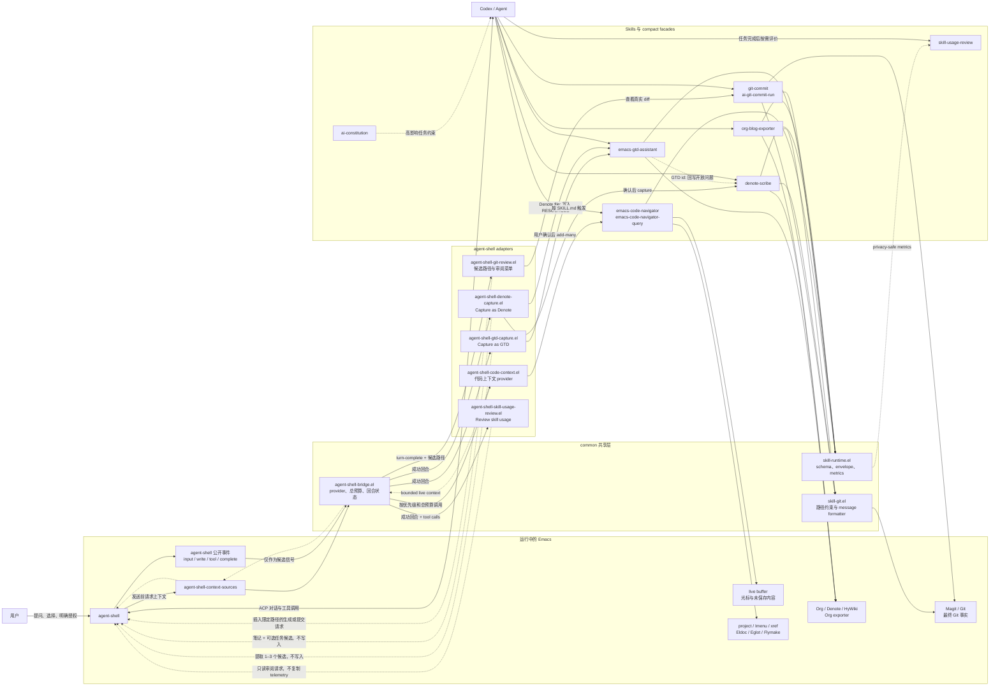

# AI Skills

一组面向 AI 助手的本地 skills。它们把可靠性约束、运行中的 Emacs 状态，以及
Denote、HyWiki、Org GTD、Org 导出和 Magit 等能力封装成可验证的工作流。

## Skills

| Skill | 功能 | 典型请求 |
| --- | --- | --- |
| [`ai-constitution`](ai-constitution/SKILL.md) | 在复杂、不确定或高影响任务中应用轻量可靠性原则：先理解和验证，再执行最小、可逆的改动；简单任务仍保持直接。 | “严格分析这个问题并验证结论” |
| [`denote-scribe`](denote-scribe/SKILL.md) | 将已完成的排障、开发或研究对话保存为中英文 Denote 批判性思考笔记；按 Git 提交节奏执行 AI Review，将成熟概念提炼到 HyWiki，并通过非交互式 Magit 提交本次生成的文件。 | “输出 Denote 报告” |
| [`emacs-code-navigator`](emacs-code-navigator/SKILL.md) | 将运行中的 Emacs 作为能力注册表和代码上下文来源：区分 live buffer 与磁盘内容并报告来源和分歧，同时支持 Help、项目搜索、Imenu、xref、Eldoc/Eglot 和 Flymake。 | “Emacs 里有什么函数能完成这个任务？”“查看这个符号的文档和源码” |
| [`emacs-gtd-assistant`](emacs-gtd-assistant/SKILL.md) | 通过 Emacs 管理 `~/Dropbox/brain/gtd.org`：列出或查找任务，新增、改状态、重新排期、设置截止日期，以及经明确授权后删除或归档。 | “列出今天的任务”“把这个任务标记为 DONE” |
| [`org-blog-exporter`](org-blog-exporter/SKILL.md) | 将 `~/Dropbox/notes` 中符合条件的 Org 笔记导出为静态 HTML；支持单篇、批量和全量导出。明确要求发布时，还可更新索引、复制并重写本地资源、提交并推送博客仓库。 | “预览这篇 Org 笔记”“发布博客” |
| [`git-commit`](git-commit/SKILL.md) | 为任意仓库生成便于 AI 和人理解的提交信息；读取含未跟踪文件的实际 diff，按风险选择详细度，并可暂存和提交明确的文件集合。 | “生成 commit message”“提交这些修改” |
| [`skill-usage-review`](skill-usage-review/SKILL.md) | 根据当前对话中的实际调用和本地 metrics，评价 skill 的有效上下文、调用次数、重试、路由复杂度与安全开销。 | “评价本轮 skills 使用情况” |

每个目录中的 `SKILL.md` 只保留触发条件、需要模型判断的规则和授权边界；可确定执行的
流程由 `scripts/*.el` 的公共函数、docstring 与校验错误构成。正常使用时无需让助手通读
实现源码。

每个 Emacs 集成 skill 提供一个 compact 主入口：Navigator 限制 Help 长度，GTD 和博客
限制列表结果，Git Commit 限制 diff 总量，Denote Review 分页返回关键章节。AI 调用只使用
各 skill 的统一主入口，完整上下文仅在 compact 结果不足时按需请求。

## 当前架构

调用关系如下。实线表示直接调用或事件传递，虚线表示上下文返回、请求插入或 metrics
汇总：



`agent-shell-bridge.el` 是唯一直接编排 `agent-shell-context-sources` 的组件。它把自己放在
显式 `region`、`error` 之后，为所有已注册 provider 执行同一个默认 1,800 字符硬上限，
按优先级组合适用内容，并隔离单个 provider 的错误。新增 skill 应注册 provider，不应自行
重排 agent-shell 的来源列表。桥接 metrics 只记录耗时、字符数和状态，不保留上下文原文。

桥接层还通过 agent-shell 公开的 `input-submitted`、`file-write`、`tool-call-update`、
`turn-complete` 和 `clean-up` 事件维护每个 shell buffer 独立的回合状态。事件中的文件路径
只作为候选范围和 UI 触发信号，不能证明整个 Git diff 属于本轮 Agent。

代码上下文 adapter 仍由 `emacs-code-navigator` 负责：读取 live buffer、光标、未保存状态、
project、scope、Eglot/Eldoc、少量 xref 定义和已有 Flymake 诊断。公共 bridge 不理解代码
语义，也不会为了收集上下文启动 Flymake。

Git adapter 在写文件的回合结束后提供当前 diff、提交信息请求和提交请求入口。它会按仓库
拆分候选路径；真正审阅或提交时，`git-commit` 必须再次从 Git/Magit 获取状态和 diff，
并传入明确的 `:paths`。不同仓库不会合并提交，agent-shell 事件不会替代 Git 事实，也不会
触发自动提交。

GTD adapter 为成功回合提供英文 `Capture as GTD` action。点击后由同一个 Agent 从上一轮
回答提取一至三个候选任务，先在对话中确认标题、优先级、标签、背景和资源链接；只有用户
明确确认后，才通过 `add-many` 写入 Org。可查询的来源和项目放入 properties，简短背景与
HTTP、文档、源码链接分别放入可折叠 drawer，不保存整段对话。

Denote adapter 提供英文 `Capture as Denote` action，先生成符合 critical template 的笔记
提案和零至三个可选 GTD 后续任务。确认后先创建 Denote，再把该文件作为 `file:` resource
写入每个 GTD，最后把返回的 GTD `id:` 链接写回 Denote 的 `Related GTD / 相关 GTD`
二级小节。跨文件操作不伪装成原子事务；后续步骤失败时必须报告已完成部分并提供修复。
该流程不会自动创建 HyWiki、commit 或 push。

提交信息中的 `validation` 仍是 AI 必须提供的内部证据，用于判断声明是否可靠；`git-commit`
默认不把测试命令、通过数量等 validation 内容写入 commit body，而是在操作完成后向用户
报告。commit body 默认聚焦修改内容、原因和必要边界。

主入口统一返回 `:status`、`:operation`、`:count` 和 `:data`；分页结果增加 `:page`，副作用
增加 `:effects`。每次成功调用还返回不保留原文的 `:metrics`，包括耗时、请求字符数、
请求字段数、payload 字符数、基础响应字符数、结果数、截断、降级和来源，并用版本号
保护历史比较。字符数是可重复的本地代理，不冒充模型服务的精确 Token usage。截断和
下一页位置均为机器可读字段。仅在调用参数不明确时请求 `describe` schema，无需读取
实现源码。

任务完成后可要求“评价本轮 skills 使用情况”。`skill-usage-review` 会以正确完成为门槛，
结合当前对话中的失败重试和各调用的 `:metrics`，区分必要信息、安全信息与冗余信息；
它不会在 GitHub Actions 中调用 AI，也不会持久化调用内容。

Skill usage adapter 在成功且包含 tool call 的回合后提供英文 `Review skill usage` action。
点击后只向同一个 agent-shell 会话发送短提示，由 Agent 使用对话中已经可见的调用和
metrics 进行评价；它不重新运行任务、不把 tool 输出复制进 Emacs，也不增加自动上下文。
完成一次评价后默认抑制两轮，避免审阅动作递归评价自身。评价得到的具体工作或长期经验，
仍由用户分别选择 `Capture as GTD` 或 `Capture as Denote`，不会自动写入。

## 主要工作流

### Denote、AI Review 与 HyWiki

`denote-scribe` 不只是生成一个看起来像 Denote 的文件名，而是实际调用 Denote：

1. 根据对话语言选用中英文批判性笔记模板，区分证据、推断、反证和不确定性。
2. 创建 Denote Org 笔记，并检查距离上次 AI Review 的 Git 提交数；首次运行会进行全量 bootstrap review。
3. 先复查未解决和已解决的问题，再评估概念。只有具备可解释模型、可追溯依据、复用价值和清晰边界的成熟概念才会进入 HyWiki；一次有效 review 可以不生成概念页。
4. 通过共享 formatter 提交本次新建的 Denote 笔记和变更的 HyWiki 页面。skill 不会 push。

默认目录为 `~/Dropbox/notes/`、`~/Dropbox/hywiki/` 和 Git 仓库
`~/Dropbox/`；默认每 5 次仓库提交触发一次 review，均可通过 Emacs
custom variables 调整。Review 默认每页返回 8 篇笔记，每个关键章节最多 500 个字符；
调用方应遍历所有分页，仅对截断或有争议的证据读取全文。

### Org 博客导出与发布

`org-blog-exporter` 会跳过草稿、私有目录及带 `draft`、`private` 或
`noexport` 标签的笔记。导出时可使用 `setupfile.org` 配置 HTML；发布时还会：

- 更新博客索引；
- 将 Org 中引用的图片、音视频、PDF 等本地资源复制到仓库的 `image/` 目录，并重写导出副本中的链接；
- 仅提交本次生成的 HTML、索引和资源，然后推送配置的仓库。

Denote、博客发布和普通仓库提交共享同一套结构化证据、自然正文和 100 列 formatter；
低风险小改动自动压缩正文，高风险或多项修改保留完整边界。

导出不会隐式发布。只有用户明确要求“发布”时，skill 才能执行 clone、commit 和
push 流程。

## Requirements

通用的 Emacs 集成要求：

- `emacsclient` 位于 `PATH`，且已有运行中的 Emacs server；
- 对应 Emacs 功能在该 session 中可用。

额外依赖如下：

- `denote-scribe`：Denote、HyWiki、Magit，以及包含 `notes/` 和 `hywiki/` 的 Git 仓库；
- `emacs-code-navigator`：Emacs 的 `project`、`xref`、Imenu；Eglot 和 Flymake 为按需能力；
- `emacs-gtd-assistant`：Org mode 和已有的 GTD 文件及目标 heading；
- `org-blog-exporter`：Org HTML exporter；发布流程还需要 Magit、Git 仓库和远端权限；
- `git-commit`：Magit（用于从任意当前仓库收集提交证据）；
- agent-shell 自动上下文和回合审阅：支持 `agent-shell-context-sources` 与
  `agent-shell-subscribe-to` 的 agent-shell；
- `skill-usage-review`：无额外运行时依赖；
- `ai-constitution`：无额外运行时依赖。

## Install

将需要的 skill 目录复制或软链接到客户端使用的 skills 目录。仓库结构需要保留；
所有 Emacs skill 都会从同级 `common/` 加载统一返回协议；提交相关 skill 还会加载共享
Git formatter，因此安装任意 Emacs skill 时必须保留 `common/`。

例如，为 Codex 安装整个仓库时，可让目标目录包含：

```text
skills/
├── common/
├── ai-constitution/
├── denote-scribe/
├── emacs-code-navigator/
├── emacs-gtd-assistant/
├── org-blog-exporter/
├── git-commit/
└── skill-usage-review/
```

如果客户端支持导入压缩包，可按需打包。下面的示例包含全部 skills：

```bash
zip -r ai-skills.zip \
  common ai-constitution denote-scribe emacs-code-navigator \
  emacs-gtd-assistant org-blog-exporter git-commit skill-usage-review
```

启用或重新加载 skills 后，直接用自然语言提出表格中的请求即可。涉及删除、归档、
发布、提交或推送的操作仍受各 skill 的授权和安全检查约束。

开发修改后可运行统一契约测试：

```bash
emacs -Q --batch -l tests/skill-contract-tests.el \
  -f ert-run-tests-batch-and-exit
```

在 Emacs 配置中启用公共代码上下文和 Git 回合审阅：

```elisp
(load "/path/to/skills/emacs-code-navigator/scripts/agent-shell-code-context.el")
(emacs-code-navigator-agent-shell-enable)

(load "/path/to/skills/git-commit/scripts/agent-shell-git-review.el")
(agent-shell-git-review-enable)

(load "/path/to/skills/emacs-gtd-assistant/scripts/agent-shell-gtd-capture.el")
(agent-shell-gtd-capture-enable)

(load "/path/to/skills/denote-scribe/scripts/agent-shell-denote-capture.el")
(agent-shell-denote-capture-enable)

(load "/path/to/skills/skill-usage-review/scripts/agent-shell-skill-usage-review.el")
(agent-shell-skill-usage-review-enable)
```

回合发生文件写入后运行 `M-x agent-shell-git-review-menu`，可以查看候选文件的当前 Git
diff、插入提交信息请求，或在确认后向 Agent 提交限定路径的提交请求。运行
`M-x skill-agent-shell-turn-action-menu` 可统一选择 `Review Git changes` 或
`Capture as GTD`、`Capture as Denote`、`Review skill usage`。
