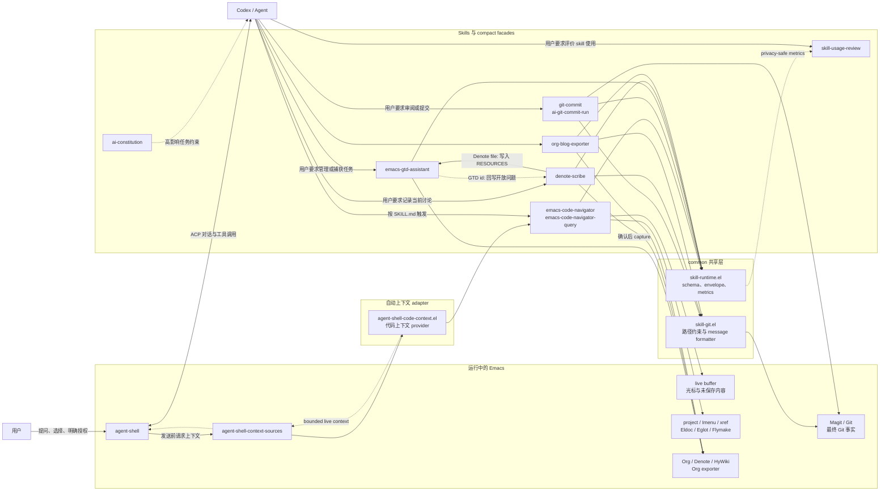

# AI Skills

一组面向 AI 助手的本地 skills。它们把可靠性约束、运行中的 Emacs 状态，以及
Denote、HyWiki、Org GTD、Org 导出和 Magit 等能力封装成可验证的工作流。

## Skills

| Skill | 功能 | 典型请求 |
| --- | --- | --- |
| [`ai-constitution`](ai-constitution/SKILL.md) | 在复杂、不确定或高影响任务中应用轻量可靠性原则：先理解和验证，再执行最小、可逆的改动；简单任务仍保持直接。 | “严格分析这个问题并验证结论” |
| [`denote-scribe`](denote-scribe/SKILL.md) | 将已完成的排障、开发或研究对话保存为中英文 Denote 批判性思考笔记；按 Git 提交节奏执行 AI Review，将成熟概念提炼到 HyWiki，并通过非交互式 Magit 提交本次生成的文件。 | “输出 Denote 报告” |
| [`emacs-code-navigator`](emacs-code-navigator/SKILL.md) | 将运行中的 Emacs 作为能力注册表和代码上下文来源：区分 live buffer 与磁盘内容并报告来源和分歧，同时支持 Help、项目搜索、Imenu、xref、Eldoc/Eglot 和 Flymake。 | “Emacs 里有什么函数能完成这个任务？”“查看这个符号的文档和源码” |
| [`emacs-gtd-assistant`](emacs-gtd-assistant/SKILL.md) | 通过 Emacs 管理 `~/Dropbox/brain/gtd.org`：列出或查找任务，新增、改状态、重新排期、设置截止日期，以及经明确授权后删除或归档。 | “列出今天的任务”“把这个任务标记为 DONE” |
| [`org-blog-exporter`](org-blog-exporter/SKILL.md) | 将 `~/Dropbox/notes` 中符合条件的 Org 笔记导出为静态 HTML；支持单篇、批量和全量导出。明确要求发布时，还可更新索引、复制并重写本地资源、提交并推送博客仓库。 | “预览这篇 Org 笔记”“发布博客” |
| [`git-commit`](git-commit/SKILL.md) | 为任意仓库生成便于 AI 和人理解的提交信息；读取含未跟踪文件的实际 diff，按风险选择详细度，并可暂存和提交明确的文件集合。 | “生成 commit message”“提交这些修改” |
| [`skill-usage-review`](skill-usage-review/SKILL.md) | 根据当前对话中的实际调用和本地 metrics，独立评价正确性、证据充分性、安全性与经济性，并诊断恢复成本。 | “评价本轮 skills 使用情况” |

每个目录中的 `SKILL.md` 只保留触发条件、需要模型判断的规则和授权边界；可确定执行的
流程由 `scripts/*.el` 的公共函数、docstring 与校验错误构成。正常使用时无需让助手通读
实现源码。

每个 Emacs 集成 skill 提供一个 compact 主入口：Navigator 限制 Help 长度，GTD 和博客
限制列表结果，Git Commit 限制 diff 总量，Denote Review 分页返回关键章节。AI 调用只使用
各 skill 的统一主入口，完整上下文仅在 compact 结果不足时按需请求。

## 当前架构

调用关系如下。实线表示直接调用或事件传递，虚线表示上下文返回、请求插入或 metrics
汇总：


```mermaid
flowchart LR
    USER["用户"]
    AGENT["Codex / Agent"]

    subgraph EMACS["运行中的 Emacs"]
        AS["agent-shell"]
        SOURCES["agent-shell-context-sources"]
        BUFFER["live buffer<br/>光标与未保存内容"]
        CODEAPI["project / Imenu / xref<br/>Eldoc / Eglot / Flymake"]
        ORG["Org / Denote / HyWiki<br/>Org exporter"]
        MAGIT["Magit / Git<br/>最终 Git 事实"]
    end

    subgraph COMMON["common 共享层"]
        RUNTIME["skill-runtime.el<br/>schema、envelope、metrics"]
        GITCORE["skill-git.el<br/>路径约束与 message formatter"]
    end

    subgraph ADAPTERS["自动上下文 adapter"]
        CODECTX["agent-shell-code-context.el<br/>代码上下文 provider"]
    end

    subgraph SKILLS["Skills 与 compact facades"]
        NAV["emacs-code-navigator<br/>emacs-code-navigator-query"]
        COMMIT["git-commit<br/>ai-git-commit-run"]
        GTD["emacs-gtd-assistant"]
        SCRIBE["denote-scribe"]
        BLOG["org-blog-exporter"]
        USAGE["skill-usage-review"]
        CONSTITUTION["ai-constitution"]
    end

    USER -->|"提问、选择、明确授权"| AS
    AS <-->|"ACP 对话与工具调用"| AGENT

    AS -->|"发送前请求上下文"| SOURCES
    SOURCES --> CODECTX
    CODECTX --> NAV
    NAV --> BUFFER
    NAV --> CODEAPI
    CODECTX -.->|"bounded live context"| SOURCES
    SOURCES -.-> AS

    AGENT -->|"用户要求管理或捕获任务"| GTD
    AGENT -->|"用户要求记录当前讨论"| SCRIBE
    AGENT -->|"用户要求审阅或提交"| COMMIT
    SCRIBE -->|"Denote file: 写入 RESOURCES"| GTD
    GTD -.->|"GTD id: 回写开放问题"| SCRIBE

    AGENT -->|"按 SKILL.md 触发"| NAV
    AGENT --> BLOG
    CONSTITUTION -.->|"高影响任务约束"| AGENT

    NAV --> RUNTIME
    COMMIT --> RUNTIME
    GTD --> RUNTIME
    SCRIBE --> RUNTIME
    BLOG --> RUNTIME
    COMMIT --> GITCORE
    SCRIBE --> GITCORE
    BLOG --> GITCORE

    GTD --> ORG
    SCRIBE -->|"确认后 capture"| ORG
    BLOG --> ORG
    COMMIT --> MAGIT
    GITCORE --> MAGIT

    RUNTIME -.->|"privacy-safe metrics"| USAGE
    AGENT -->|"用户要求评价 skill 使用"| USAGE
```

代码上下文 adapter 仍由 `emacs-code-navigator` 负责：读取 live buffer、光标、未保存状态、
project、scope、Eglot/Eldoc、少量 xref 定义和已有 Flymake 诊断。它直接接入
`agent-shell-context-sources`，保持 `region`、`error` 的优先级，执行 1,800 字符上限，
并且不会为了收集上下文启动 Flymake。

用户在 agent-shell 对话中要求审阅、生成提交信息或提交时，Agent 直接触发 `git-commit`，
从 Git/Magit 重新获取状态和 diff，并在已知文件范围时传入明确的 `:paths`。不同仓库不会
合并提交，也不会因为修改过文件而自动触发审阅或提交。限定路径的 context 只返回这些路径
的状态和内容；无关变更只报告数量，不暴露文件名。

用户在 agent-shell 对话中要求管理或捕获 GTD 时，Agent 直接触发
`emacs-gtd-assistant`。从对话捕获时先提取一至三个候选任务，在对话中确认标题、优先级、
标签、背景和资源链接；只有用户明确确认后，才通过 `add-many` 写入 Org。可查询的来源和
项目放入 properties，简短背景与 HTTP、文档、源码链接分别放入可折叠 drawer，不保存
整段对话。

用户在 agent-shell 对话中要求记录当前讨论时，Agent 直接触发 `denote-scribe`，先生成
符合 critical template 的笔记提案，并从提取的问题中提出零至三个真正有价值、可执行的
GTD 后续任务。确认后先创建 Denote，再把该文件作为 `file:` resource 写入每个 GTD，
最后把返回的 GTD `id:` 链接写回 Denote 的 `Related GTD / 相关 GTD` 二级小节。跨文件
操作不伪装成原子事务；后续步骤失败时必须报告已完成部分并提供修复。该流程不会自动创建
HyWiki、commit 或 push。

提交信息中的 `validation` 仍是 AI 必须提供的内部证据，用于判断声明是否可靠；`git-commit`
默认不把测试命令、通过数量等 validation 内容写入 commit body，而是在操作完成后向用户
报告。commit body 默认聚焦修改内容、原因和必要边界。

v2 主入口 envelope 统一返回 `:protocol-version`、`:status`、`:operation`、`:count` 和
`:data`；分页结果增加 `:page`，副作用增加 `:effects`。状态使用 `ok`、`partial`、
`needs-input`、`blocked` 或 `failed`。可预期的公共失败还返回 `:error`，至少包含稳定
`:code`、可读 `:message`、`:retry` 和 `:required-action`，并可附带字段路径、目标、
候选项或分页后的失败原因。部分成功保留已完成的 `:data` 与真实 `:effects`，同时用
`partial-failure` 指示选择性重试；未知 Lisp 错误继续抛出，避免把实现缺陷伪装成可恢复
业务状态。可选的顶层 `:verification` 按 artifact、workflow、repository 或领域判断分组
返回已完成检查及其证据；`:effects` 仍只描述实际发生的副作用。

每次成功或结构化失败调用都返回不保留原文的 `:metrics`，包括耗时、请求字符数、请求
字段数、payload 字符数、基础响应字符数、结果数、截断、降级和来源，并用版本号保护
历史比较。字符数是可重复的本地代理，不冒充模型服务的精确 Token usage。截断和下一页
位置均为机器可读字段。仅在调用参数不明确时请求 `describe` schema，无需读取实现源码。

任务完成后可要求“评价本轮 skills 使用情况”。`skill-usage-review` 会以正确完成为门槛，
结合当前对话中的失败重试和各调用的 `:metrics`，区分必要信息、安全信息与冗余信息；
分别给出正确性、证据充分性、安全性和经济性的 0–3 评级，不求和、加权或输出可相互抵消
的综合分。字符数与有效上下文比例只作为诊断证据，不作为优化目标。恢复诊断会区分可见的
失败、重试和修复成本，与因缺少证据或跳过验证而推断的潜在返工风险。它不会在 GitHub
Actions 中调用 AI，也不会持久化调用内容。

用户在 agent-shell 对话中要求审阅本轮 skill 使用时，Agent 直接触发
`skill-usage-review`，使用对话中已经可见的调用和 metrics 进行四维独立评价和恢复成本
诊断；它不重新运行任务、不把 tool 输出复制进 Emacs，也不增加自动上下文。评价得到的
具体工作或长期经验仍由用户显式选择 GTD 或 Denote 捕获，不会自动写入。

## 主要工作流

### Denote、AI Review 与 HyWiki

`denote-scribe` 不只是生成一个看起来像 Denote 的文件名，而是实际调用 Denote：

1. 根据对话语言选用中英文批判性笔记模板，区分证据、推断、反证和不确定性。
2. 创建 Denote Org 笔记，并检查距离上次 AI Review 的 Git 提交数；首次运行会进行全量 bootstrap review。
3. 先复查未解决和已解决的问题，再评估概念。只有具备可解释模型、可追溯依据、复用价值和清晰边界的成熟概念才会进入 HyWiki；一次有效 review 可以不生成概念页。
4. 通过共享 formatter 提交本次新建的 Denote 笔记和变更的 HyWiki 页面。skill 不会 push。

默认目录为 `~/Dropbox/notes/`、`~/Dropbox/hywiki/` 和 Git 仓库
`~/Dropbox/`；默认每 5 次仓库提交触发一次 review，均可通过 Emacs
custom variables 调整。Review 默认每页返回 8 篇笔记，每个关键章节最多 500 个字符；
调用方应遍历所有分页，仅对截断或有争议的证据读取全文。

### Org 博客导出与发布

`org-blog-exporter` 会跳过草稿、私有目录及带 `draft`、`private` 或
`noexport` 标签的笔记。导出时可使用 `setupfile.org` 配置 HTML；发布时还会：

- 更新博客索引；
- 将 Org 中引用的图片、音视频、PDF 等本地资源复制到仓库的 `image/` 目录，并重写导出副本中的链接；
- 仅提交本次生成的 HTML、索引和资源，然后推送配置的仓库。

Denote、博客发布和普通仓库提交共享同一套结构化证据、自然正文和 100 列 formatter；
低风险小改动自动压缩正文，高风险或多项修改保留完整边界。

导出不会隐式发布。只有用户明确要求“发布”时，skill 才能执行 clone、commit 和
push 流程。

## Requirements

通用的 Emacs 集成要求：

- `emacsclient` 位于 `PATH`，且已有运行中的 Emacs server；
- 对应 Emacs 功能在该 session 中可用。

额外依赖如下：

- `denote-scribe`：Denote、HyWiki、Magit，以及包含 `notes/` 和 `hywiki/` 的 Git 仓库；
- `emacs-code-navigator`：Emacs 的 `project`、`xref`、Imenu；Eglot 和 Flymake 为按需能力；
- `emacs-gtd-assistant`：Org mode 和已有的 GTD 文件及目标 heading；
- `org-blog-exporter`：Org HTML exporter；发布流程还需要 Magit、Git 仓库和远端权限；
- `git-commit`：Magit（用于从任意当前仓库收集提交证据）；
- agent-shell 自动上下文：agent-shell 支持 `agent-shell-context-sources`；
- `skill-usage-review`：无额外运行时依赖；
- `ai-constitution`：无额外运行时依赖。

## Install

将需要的 skill 目录复制或软链接到客户端使用的 skills 目录。仓库结构需要保留；
所有 Emacs skill 都会从同级 `common/` 加载统一返回协议；提交相关 skill 还会加载共享
Git formatter，因此安装任意 Emacs skill 时必须保留 `common/`。

例如，为 Codex 安装整个仓库时，可让目标目录包含：

```text
skills/
├── common/
├── ai-constitution/
├── denote-scribe/
├── emacs-code-navigator/
├── emacs-gtd-assistant/
├── org-blog-exporter/
├── git-commit/
└── skill-usage-review/
```

如果客户端支持导入压缩包，可按需打包。下面的示例包含全部 skills：

```bash
zip -r ai-skills.zip \
  common ai-constitution denote-scribe emacs-code-navigator \
  emacs-gtd-assistant org-blog-exporter git-commit skill-usage-review
```

启用或重新加载 skills 后，直接用自然语言提出表格中的请求即可。涉及删除、归档、
发布、提交或推送的操作仍受各 skill 的授权和安全检查约束。

开发修改后可运行统一契约测试：

```bash
emacs -Q --batch -l tests/run-tests.el
emacs -Q --batch -l tests/run-tests.el emacs-gtd-assistant-tests.el
```

不带 suite 参数时运行全部测试；传入一个或多个 suite 文件名时，只加载对应领域实现，
便于隔离定位失败。测试入口会初始化已安装的 Emacs packages；需要 Magit 或 Git 的 suite
会显式检查依赖，使真实的路径限定 context 测试不会在 `-Q` 环境中静默跳过。

`tests/routing-cases.el` 保存 skill 路由的正反案例，供人工评审或另行固定模型版本的评测
使用。常规 ERT 只校验案例结构、skill 名称和边界完整性，不用关键词匹配冒充模型路由结果。

在 Emacs 配置中启用公共代码上下文：

```elisp
(load "/path/to/skills/emacs-code-navigator/scripts/agent-shell-code-context.el")
(emacs-code-navigator-agent-shell-enable)
```

Git Review、Denote、独立 GTD 捕获和 skill 使用审阅都不注册回合动作；用户在 agent-shell
对话中表达相应意图后，由 Agent 依据 skill 元数据直接触发并执行。
